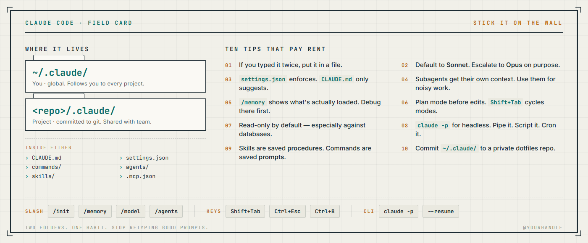
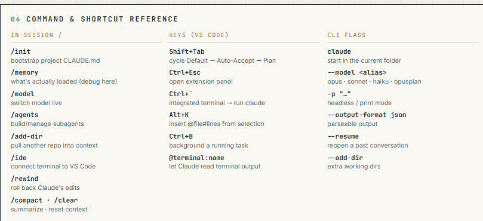

# From four terminals to one good folder.

Last Tuesday I had four terminals open. Three VS Code windows. Different Claude sessions in each — one pulling database schemas, one reading legacy repos to take notes, one summarizing those notes into instructions for an agent I'm building, and one I genuinely cannot account for.

I was alt-tabbing between them like a raccoon trying to remember which trash can had the good stuff. Copy-pasting prompts from a Notes file called `prompts_GOOD.md`. Re-explaining to each instance that yes, I'm on Windows, no, please don't put PowerShell paths in WSL commands, for the love of god.

It worked. It was also stupid.

The fix isn't more terminals. The fix is realizing Claude Code is configured by **files on disk**, and once that clicks you stop doing this shit by hand every day. Here's the short version.

## The whole trick

Two folders. That's basically it.

- `~/.claude/` — your stuff. Follows you everywhere.
- `<repo>/.claude/` — this project's stuff. Lives in git.

Inside either, you drop:

- `CLAUDE.md` — instructions Claude reads at session start. A system prompt you don't have to retype.
- `settings.json` — actual permissions. The model can *suggest* `rm -rf /`; the settings decide whether it can *run* it.
- `commands/foo.md` — a slash command. `/foo` fires your saved prompt.
- `agents/bar.md` — a subagent. Its own brain, its own job, its own context window.

That's the whole game. Once these files exist you stop being the orchestrator and start being the person who designed the orchestrator.



## A minimal `~/.claude/CLAUDE.md`

Drop this in your home directory. Edit to taste.

```markdown
# About me
- Sysadmin. Windows host, WSL2 (Ubuntu), VS Code.
- I want plans before edits, small diffs, no surprises.

# Hard rules
- Read-only against any database unless I explicitly say otherwise.
- Never echo secrets. Treat .env, *.pem, anything in secrets/ as radioactive.
- No destructive shell without confirmation. You know what destructive means.

# Style
- Lead with the answer. Skip the preamble.
- Match the existing code style. Your defaults are not my defaults.
```

Now every project starts knowing who I am instead of me explaining it for the hundredth time.



## A lab that isn't another to-do app

Most AI tutorials have you build a to-do app. Here's something you'll actually use: **make Claude Code clean up your scripts folder.**

You know the one. `~/scripts/` or `~/sql/` or wherever the bodies are buried. Forty .py files with names like `final.py`, `final_v2.py`, `final_REAL.py`. Three of them do almost the same thing. Two of them haven't run since 2022 and you're not sure if that's because they're broken or because the system they touched doesn't exist anymore.

### Do this:

1. Make a `~/scripts-cleanup/` folder and `cd` into it.
2. Create `.claude/commands/inventory-scripts.md`:

```markdown
---
description: Inventory a scripts directory and propose a sane organization
argument-hint: [path]
allowed-tools: Read, Glob, Grep, Bash
model: sonnet
---
Look at directory `$1`. Do NOT move or delete anything yet.

1. Find all .py, .sh, .sql, .ps1 files. Group by extension. Note total count and size.
2. Read the first 30 lines of each (skip files >1MB). From that, infer purpose in one sentence.
3. Flag suspected duplicates and near-duplicates: similar names, similar imports, similar first lines.
4. Flag risk: hardcoded paths, embedded secrets, references to hosts or DBs that may no longer exist.
5. Propose a tidy structure: subfolders by purpose (backups/, db-pulls/, monitoring/, one-offs/, archive/), plus rename suggestions for the `final_REAL_v3` situation.
6. Write the plan to PLAN.md. Do not execute. I'll review.
```
> The `$1` is the first argument on the command line just line any other script.

3. Run `claude`, then:

```
/inventory-scripts ~/scripts
```

4. Read `PLAN.md`. If it's not unhinged, follow up with:

	`Execute the plan. Move, don't delete. Generate INDEX.md describing every script. Log moves to MOVES.log so I can undo.`

5. Watch it actually do it.

You now have an indexed scripts library, instead of a folder you're slightly afraid of. The first time it works you will feel mildly weird. You didn't write a line of code, but you got your robot to organize your files for you by just 'understanding' them and 'your instructions' (or rather, predicting the next token).

## What actually changed for me

- One terminal, one Claude session, fan out with subagents instead of opening new windows like a maniac.
- `~/.claude/CLAUDE.md` ate my `prompts_GOOD.md` file. Good riddance.
- Default model is `opusplan` — Opus thinks, Sonnet types. Cheaper, still smart.
- I run `claude -p`  headless inside real bash scripts now. Same tool, no editor.

I still have four terminals open sometimes. Just not for the same job.
