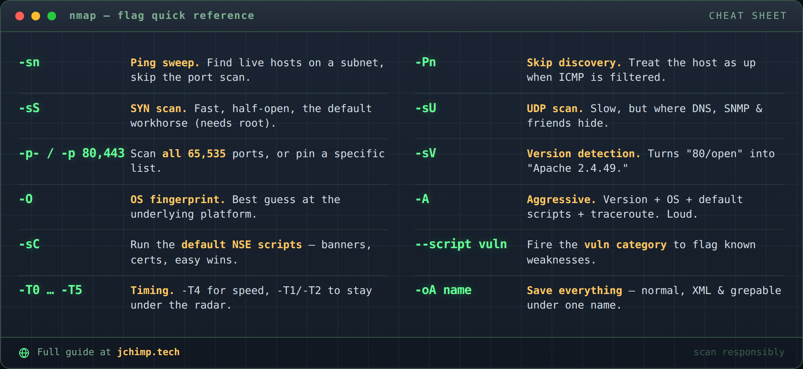

# nmap: 65,535 Ports and the Seven You'll Actually Scan

The nmap man page is enormous. It scrolls forever and I've never read the whole thing, and I'd bet money you haven't either. The good news is the daily reality is about seven flags doing nearly all the work, and the rest is stuff you'll look up once a decade, when you need it.

So here's the short list. The flags that earn their keep.

Usual disclaimer, because someone always asks: scan your own stuff. A box you own, a VM on your bench, your homelab. Pointing this at machines you don't have permission to touch is how you end up having a very unfun conversations. Spin up a throwaway VM, give it an IP, aim there.



## Who's even home

Before you scan ports you need targets, and `-sn` gets you that. It's a ping sweep with the port scan switched off, so it just tells you what's alive on the subnet.

```bash
nmap -sn 192.168.1.0/24
```

Plenty of hosts are set up to ignore pings and play dead, though. If a box you *know* is up keeps coming back as down, reach for `-Pn`. It skips the "are you alive" check and just scans the thing.

```bash
nmap -Pn 192.168.1.50
```

You'll want `-Pn` whenever ICMP is filtered, which on anything remotely hardened is most of the time.

## Open doors

This is the part everyone pictures when they think "scanning." Your default workhorse is the SYN scan:

```bash
nmap -sS 192.168.1.50
```

It's fast, and it's half-open — it never finishes the handshake, so it's a touch quieter than a full connect. You need root for it. Run it without root and nmap just quietly drops to a noisier connect scan instead of yelling at you.

By default it only checks the 1,000 most common ports. Sensible, and also a great way to miss whatever someone stood up on 8443 two years ago and forgot. When you want all of them:

```bash
nmap -sS -p- 192.168.1.50
```

That's the full 65,535. It's slower. Go get a coffee. And don't forget UDP — DNS, SNMP, and a bunch of services nobody thinks about live over there, mostly ignored because UDP scanning is slow and kind of miserable:

```bash
nmap -sU --top-ports 20 192.168.1.50
```

I capped that at the top 20 on purpose. A full UDP scan is a leave-it-running-overnight decision, not a wait-for-it one.

## Okay, but what is it

An open port is a hint. `-sV` is where it pays off — it actually talks to the service and tells you what's running.

```bash
nmap -sV 192.168.1.50
```

That's the gap between "port 80 is open" and "Apache 2.4.49." One of those you can drop straight into a CVE search. The other is trivia.

For the kitchen sink, `-A` bolts on version detection, OS fingerprinting, the default scripts, and traceroute in one go:

```bash
nmap -A 192.168.1.50
```

The A is for aggressive and it isn't kidding. Great on an internal box you're cleared to be loud on. If you're trying to stay quiet, it has the subtlety of a car alarm.

## Let the scripts do it

nmap has a whole scripting engine (NSE) that most people never touch, which is a waste, because `-sC` runs the default set for free:

```bash
nmap -sC -sV 192.168.1.50
```

Banners, certs, the low-hanging stuff — it just hands them over. And when you specifically want to go poking for problems, there's a vuln category:

```bash
nmap --script vuln 192.168.1.50
```

Heads up, the vuln scripts run hot. They'll flag things that turn out to be nothing. Read the output as "worth a look," not as a verdict.

## The line I actually paste

On most internal jobs I kick off with some version of this and tighten it from there:

```bash
nmap -sS -sV -sC -O -p- -T4 -oA scan_results 192.168.1.50
```

SYN scan, version detection, default scripts, OS detection, every port, faster timing with `-T4`, and `-oA` to dump the results in all three formats (normal, XML, grepable) under one name. `-oA` is the one I always forgot until about half a second after closing the terminal, so now it's muscle memory.


## A ten-minute lab

You're not going to learn this from me, you're going to learn it by running it. First you need something to point it at. If you don't already have a spare box, an Ubuntu Server VM takes about five minutes:

1. Grab the ISO. Pull the latest Ubuntu Server LTS from [ubuntu.com/download/server](https://ubuntu.com/download/server). The Server image, not Desktop — you don't need a GUI to get scanned.
2. Make the VM. VirtualBox, VMware, Hyper-V, Proxmox, whatever you already run. New VM, point it at the ISO, give it 2 GB RAM and one CPU. It's a target, not a workstation.
3. Set the network to **bridged**, not NAT. Bridged puts the VM on your actual LAN with its own IP so you can reach it from your host. NAT hides it behind the hypervisor and you'll spend twenty minutes wondering why nothing answers.
4. Run through the installer, make a user, and — this is the point — tick **Install OpenSSH server** when it offers. Now you've got at least one open port to find. Bonus points for `sudo apt install apache2` afterward so there's more to discover.
5. Log in and run `ip a` to grab the VM's address. That's your target.

Now the actual loop:

1. Find it: `nmap -sn <your-subnet>/24`
2. Scan it: `nmap -sS -p- <vm-ip>`
3. Fingerprint it: `nmap -sV -sC <vm-ip>`
4. Look at what came back and ask the only question that matters: should that be open?

That last step is the actual job. nmap is excellent at telling you what's there. Working out what *shouldn't* be there is the part that's on you.

Go scan your own network. You'll turn up at least one thing you forgot was running.
