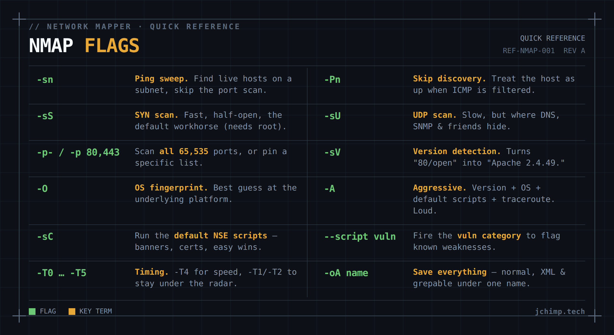

# nmap: the working set

Notes on the nmap flags that actually come up in network admin and security work. Not the whole man page — nobody has read the whole man page — just the handful worth committing to muscle memory, plus a small lab to keep them there. Targets are your own boxes only: a VM on the bench, something in the rack, anything you own. Scanning hosts you don't have permission to touch is a different kind of afternoon.

Examples assume a target at `192.168.1.50` on a `192.168.1.0/24` network. Swap in your own.

<a href="../images/nmap-banner.png" target="_blank" rel="noopener"></a>

## Host discovery

Find what's alive before scanning ports. `-sn` runs a ping sweep with the port scan switched off. It reports which hosts on the subnet answer, nothing more.

```bash
nmap -sn 192.168.1.0/24
```

Plenty of hosts drop ICMP and play dead even when they're up. When a box you know is alive won't show, `-Pn` skips discovery and scans as if it's online. On anything hardened, ICMP is filtered often enough that this stops being the exception and becomes the habit.

```bash
nmap -Pn 192.168.1.50
```

## Port scanning

The SYN scan is the standard. It's half-open, meaning the handshake never finishes, which makes it fast and a little quieter than a full connect. It needs root; without it, nmap quietly drops to a TCP connect scan and doesn't make a thing of it.

```bash
nmap -sS 192.168.1.50
```

By default nmap checks the top 1,000 ports. Reasonable, and also exactly how you miss the service someone stood up on a weird port eighteen months ago and never mentioned. `-p-` scans the full range when you'd rather be thorough than quick.

```bash
nmap -sS -p- 192.168.1.50
```

That's all 65,535 ports, and it takes a while. UDP deserves a pass too. DNS, SNMP, and friends live there and get ignored because UDP scanning is slow and a bit joyless. Capping it to the common ports keeps the runtime reasonable.

```bash
nmap -sU --top-ports 20 192.168.1.50
```

A full UDP scan with no cap is an overnight job, not something you sit and wait on.

## Service and OS detection

An open port just means something's listening. `-sV` probes the service and tells you what's running and which version.

```bash
nmap -sV 192.168.1.50
```

That's the gap between "80/open" and "Apache 2.4.49." The second one is a CVE search, the first is trivia. For everything in one shot, `-A` turns on version detection, OS fingerprinting, default scripts, and traceroute together. Thorough, and about as subtle as a car alarm, so save it for boxes where loud is fine.

```bash
nmap -A 192.168.1.50
```

## NSE scripts

nmap ships with a whole scripting engine and most people never touch it, which is a shame, because `-sC` runs the default set for free: banners, certs, the easy stuff.

```bash
nmap -sC -sV 192.168.1.50
```

The `vuln` category checks discovered services against known weaknesses. It runs enthusiastic and throws false positives, so read the output as "worth a look," not a verdict.

```bash
nmap --script vuln 192.168.1.50
```

## The standard one-liner

A sane default for an internal box, tightened from there as needed:

```bash
nmap -sS -sV -sC -O -p- -T4 -oA scan_results 192.168.1.50
```

SYN scan, version detection, default scripts, OS detection, all ports, `-T4` timing, and `-oA` to write output in all three formats (normal, XML, grepable) under one name. `-oA` is the flag you forget right up until the half-second after you close the terminal.

## Lab: a target in ten minutes

These stick once you've run them against something real instead of reading about them. An Ubuntu Server VM is the fastest target to stand up.

1. **ISO** — latest Ubuntu Server LTS from [ubuntu.com/download/server](https://ubuntu.com/download/server). Server, not Desktop; it doesn't need a GUI to get scanned.
2. **VM** — whatever hypervisor you already run (VirtualBox, VMware, Hyper-V, Proxmox). 2 GB RAM and 1 CPU is plenty. It's a target, not a daily driver.
3. **Network: bridged, not NAT.** Bridged gives the VM its own IP on the LAN where the host can reach it. NAT tucks it behind the hypervisor, and you'll burn twenty minutes wondering why nothing answers.
4. **Install** — make a user and tick **OpenSSH server** during setup, so there's at least one open port waiting. `sudo apt install apache2` afterward gives you a second thing to find.
5. **Address** — `ip a` on the VM to grab its IP. That's your target.

Then the loop:

```bash
nmap -sn 192.168.1.0/24        # find it
nmap -sS -p- <vm-ip>           # scan it
nmap -sV -sC <vm-ip>           # fingerprint it
```

The last step isn't a command. Look at what came back and ask whether each open port has any business being open. nmap is great at telling you what's listening; working out what shouldn't be is the part that's actually yours.

## Reference: the working set

| Flag                | Purpose                                         |
| ------------------- | ----------------------------------------------- |
| `-sn`               | Ping sweep, no port scan — find live hosts      |
| `-Pn`               | Skip host discovery, assume up (ICMP filtered)  |
| `-sS`               | SYN scan, half-open, default (needs root)       |
| `-sU`               | UDP scan — slower, covers DNS/SNMP/etc.         |
| `-p-` / `-p 80,443` | All 65,535 ports, or a specific list            |
| `-sV`               | Version detection on open services              |
| `-O`                | OS fingerprint                                  |
| `-A`                | Aggressive: version + OS + scripts + traceroute |
| `-sC`               | Default NSE scripts                             |
| `--script vuln`     | Check services against known vulns              |
| `-T0`-`-T5`         | Timing; `-T4` fast, `-T1`/`-T2` quieter         |
| `-oA name`          | Save normal + XML + grepable output             |
