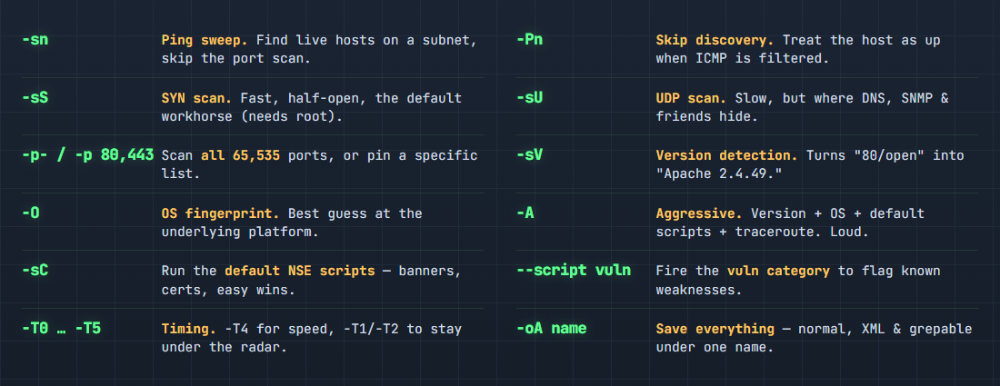

# nmap: the working set

Notes on the nmap flags that come up in actual homelab work. Not the whole man page — just the handful that earn a place in muscle memory, plus a small lab to keep them sharp. Targets are your own boxes only: a VM on the bench, something in the rack, anything you own. Scanning hosts you don't have permission to touch is a different kind of afternoon.

The examples assume a target at `192.168.1.50` on a `192.168.1.0/24` network. Substitute your own.



## Host discovery

Find what's alive before scanning ports. `-sn` runs a ping sweep with the port scan disabled — it reports which hosts on the subnet respond, nothing more.

```bash
nmap -sn 192.168.1.0/24
```

Some hosts drop ICMP and will read as down even when they're up. When a known-live box won't show, `-Pn` skips discovery entirely and scans as if the host is online. On hardened systems with ICMP filtered, this is the default move rather than the exception.

```bash
nmap -Pn 192.168.1.50
```

## Port scanning

The SYN scan is the standard. It's half-open — the handshake never completes — which makes it fast and marginally quieter than a full connect scan. It needs root; without it, nmap falls back to a TCP connect scan automatically.

```bash
nmap -sS 192.168.1.50
```

By default nmap only checks the top 1,000 ports. That misses anything parked on an uncommon port, so `-p-` covers the full range when thoroughness matters more than speed.

```bash
nmap -sS -p- 192.168.1.50
```

That's all 65,535 ports and it takes noticeably longer. UDP is worth a pass too — DNS, SNMP, and similar services live there and get skipped because UDP scanning is slow. Capping it to the common ports keeps the runtime sane.

```bash
nmap -sU --top-ports 20 192.168.1.50
```

A full UDP scan (`-sU` with no port cap) is an overnight job, not an interactive one.

## Service and OS detection

An open port only tells you something is listening. `-sV` probes the service to identify what's actually running and which version.

```bash
nmap -sV 192.168.1.50
```

The difference is "80/open" versus "Apache 2.4.49" — the version string is what a CVE lookup needs. For everything at once, `-A` enables version detection, OS fingerprinting, default scripts, and traceroute in a single pass. It's thorough and noisy; fine on a box where being loud doesn't matter, less so when stealth is the point.

```bash
nmap -A 192.168.1.50
```

## NSE scripts

nmap ships with the Nmap Scripting Engine, and most of it goes unused. `-sC` runs the default script set — banner grabs, certificate details, common checks — at no extra effort.

```bash
nmap -sC -sV 192.168.1.50
```

The `vuln` category specifically checks discovered services against known weaknesses. It's prone to false positives, so treat results as leads to verify rather than confirmed findings.

```bash
nmap --script vuln 192.168.1.50
```

## The standard one-liner

A reasonable default for an internal box, refined from there as needed:

```bash
nmap -sS -sV -sC -O -p- -T4 -oA scan_results 192.168.1.50
```

That's SYN scan, version detection, default scripts, OS detection, all ports, `-T4` timing, and `-oA` to write output in all three formats (normal, XML, grepable) under one base name. `-oA` is the easy one to forget and the annoying one to need after the fact.

## Reference: the working set

| Flag | Purpose |
|------|---------|
| `-sn` | Ping sweep, no port scan — find live hosts |
| `-Pn` | Skip host discovery, assume up (ICMP filtered) |
| `-sS` | SYN scan, half-open, default (needs root) |
| `-sU` | UDP scan — slower, covers DNS/SNMP/etc. |
| `-p-` / `-p 80,443` | All 65,535 ports, or a specific list |
| `-sV` | Version detection on open services |
| `-O` | OS fingerprint |
| `-A` | Aggressive: version + OS + scripts + traceroute |
| `-sC` | Default NSE scripts |
| `--script vuln` | Check services against known vulns |
| `-T0`–`-T5` | Timing; `-T4` fast, `-T1`/`-T2` quieter |
| `-oA name` | Save normal + XML + grepable output |

## Lab: a target in ten minutes

The flags stick once they're run against something real. An Ubuntu Server VM is the quickest target to stand up.

1. **ISO** — latest Ubuntu Server LTS from [ubuntu.com/download/server](https://ubuntu.com/download/server). Server, not Desktop; no GUI needed.
2. **VM** — any hypervisor (VirtualBox, VMware, Hyper-V, Proxmox). 2 GB RAM, 1 CPU is plenty for a target.
3. **Network: bridged, not NAT.** Bridged gives the VM its own IP on the LAN, reachable from the host. NAT hides it behind the hypervisor and nothing will answer.
4. **Install** — create a user and enable **OpenSSH server** during setup, so there's at least one open port. `sudo apt install apache2` afterward adds a second service to find.
5. **Address** — `ip a` on the VM to note its IP. That's the target.

Then the loop:

```bash
nmap -sn 192.168.1.0/24        # find it
nmap -sS -p- <vm-ip>           # scan it
nmap -sV -sC <vm-ip>           # fingerprint it
```

The last step isn't a command. Look at what came back and decide whether each open port should be there. nmap reports what's listening; judging what shouldn't be is the part worth practicing.
