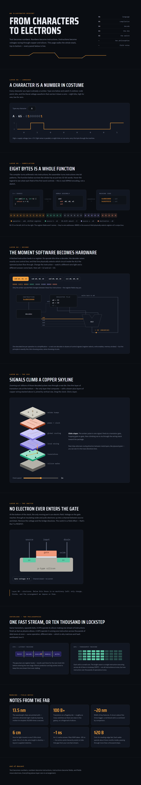

# From Characters to Electrons

An **interactive** infographic about the journey of a character from its creation in the ASCII chart, through the process of encoding it into binary and then to an electron.

**<a href="../files/characters-to-electrons/characters-to-electrons.html" target="_blank" rel="noopener">From Characters to Electrons</a>**

